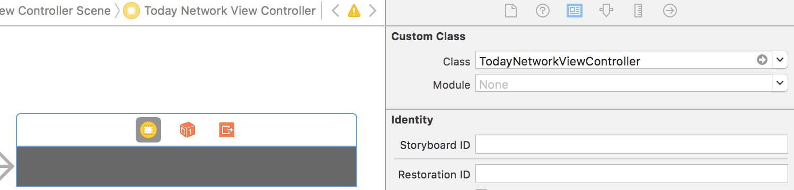

[documents](https://github.com/liuyanhongwl/ios_common/blob/master/files/ios-today-extension.md)

通过更换TodayExtension Target下面MainInterface.storyboard里的vc, 使用两种不同的今日面板，一个是本地交互的（TodayLocalViewController），一个是网络请求的(TodayNetworkViewController)。

